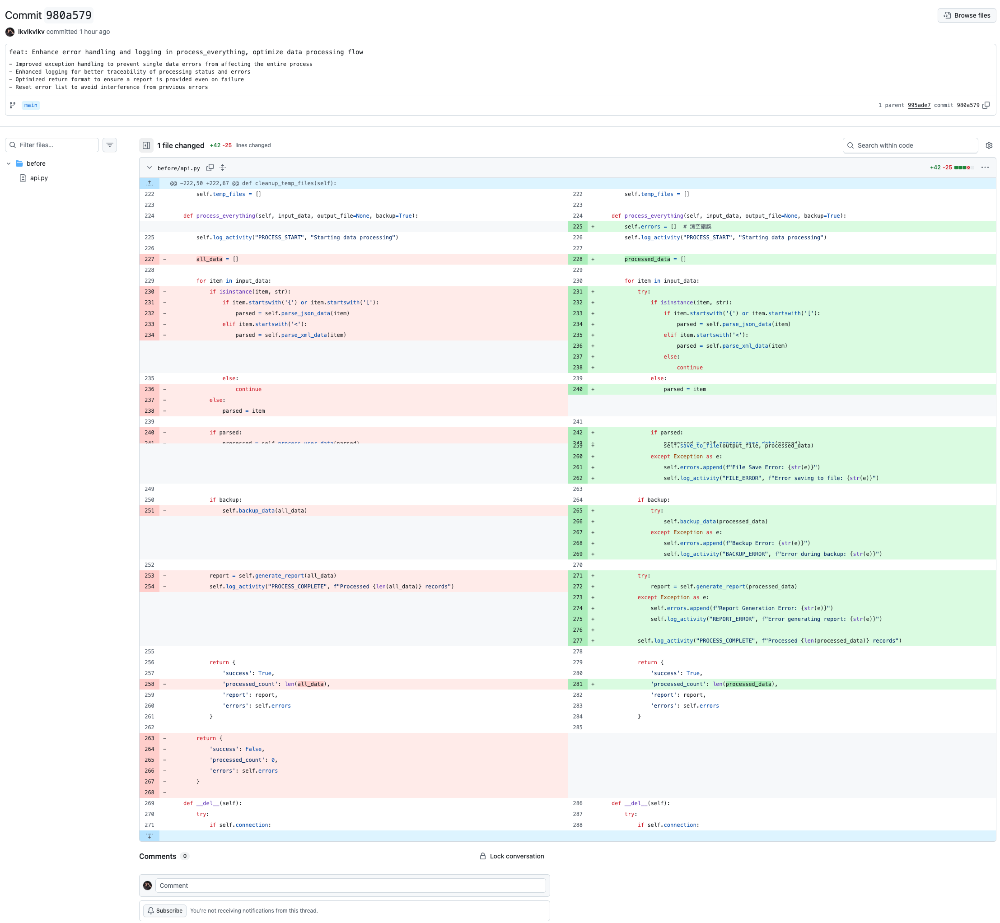
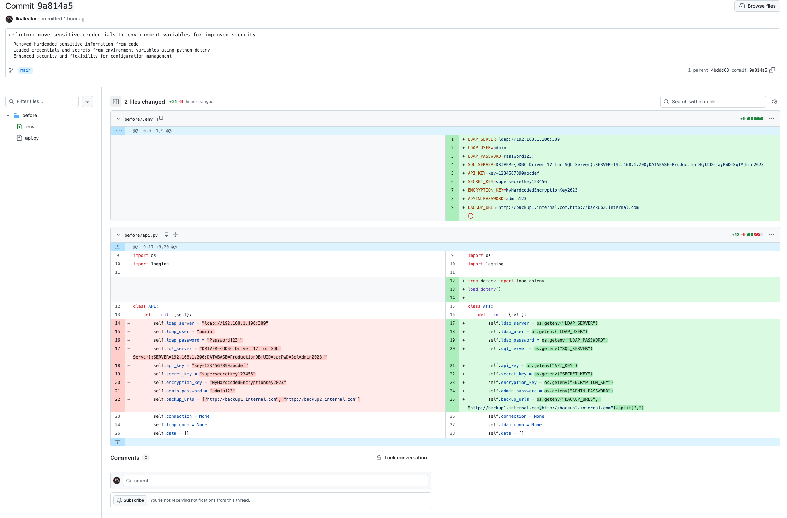

## Git Commit Report

## Changelog

1. **feat: Enhance error handling and logging in process_everything, optimize data processing flow**  
   - Improved exception handling to prevent single data errors from affecting the entire process
   - Enhanced logging for better traceability of processing status and errors
   - Optimized return format to ensure a report is provided even on failure
   - Reset error list to avoid interference from previous errors
   - 

2. **feat: Enhance save_to_database by using parameterized queries to prevent SQL injection**  
   - Changed SQL insert statements to use parameterized queries
   - Improved database operation security and prevented SQL injection risks
   - 

3. **refactor: move sensitive credentials to environment variables for improved security**  
   - Removed hardcoded sensitive information from code
   - Loaded credentials and secrets from environment variables using python-dotenv
   - Enhanced security and flexibility for configuration management
   - 
